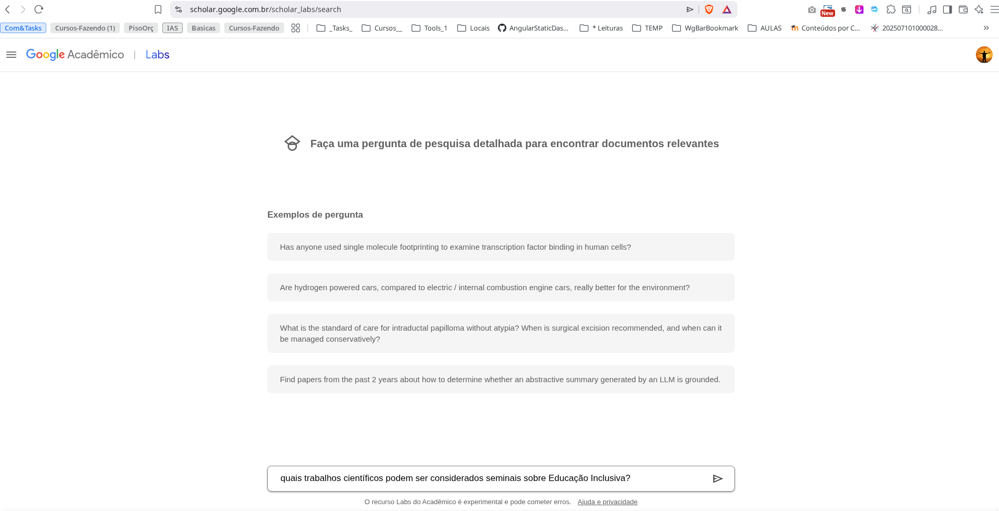
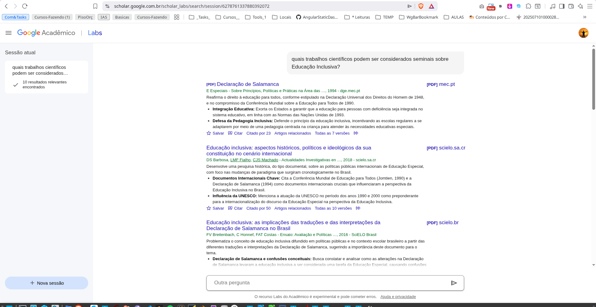
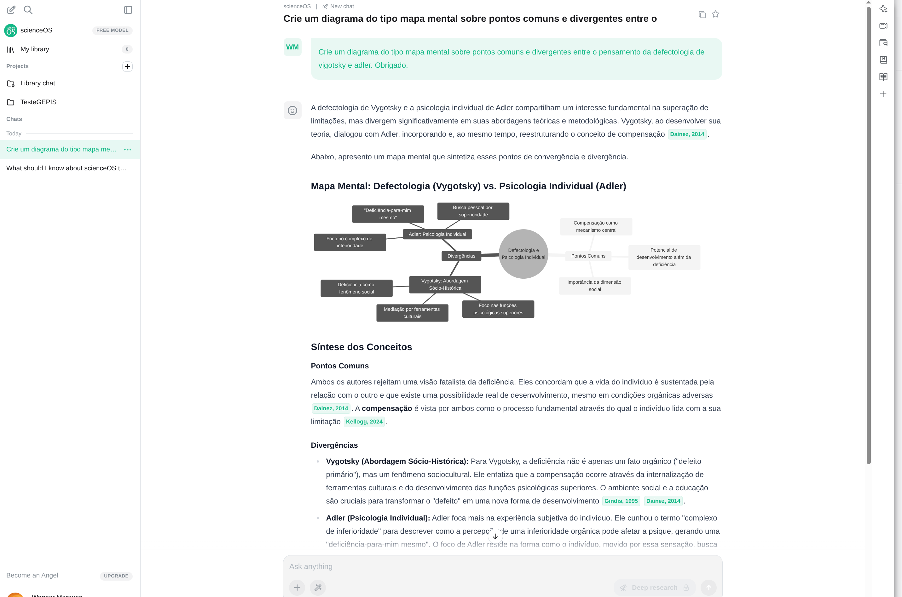
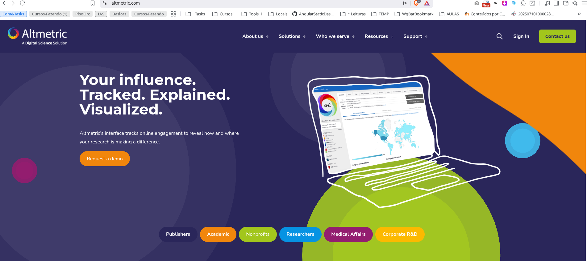
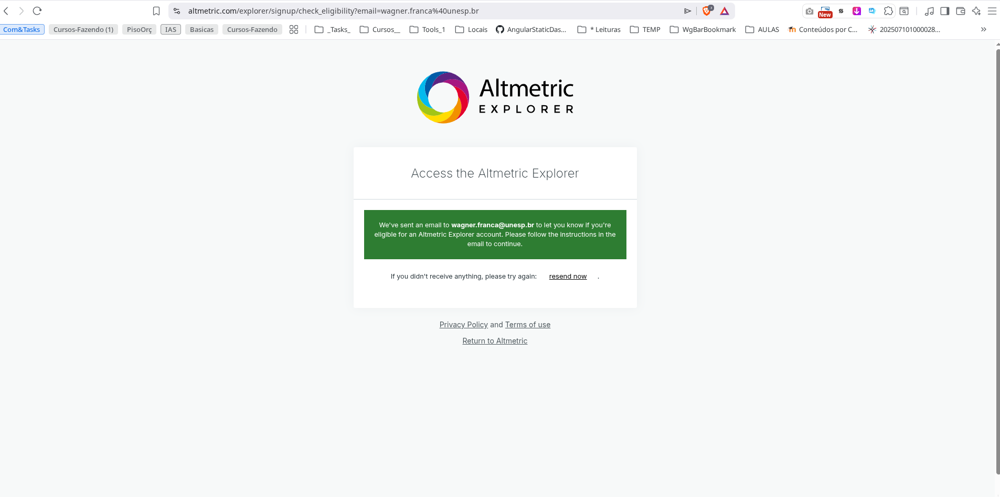
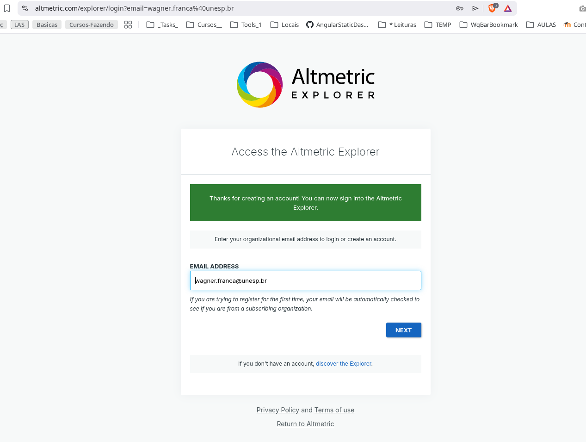
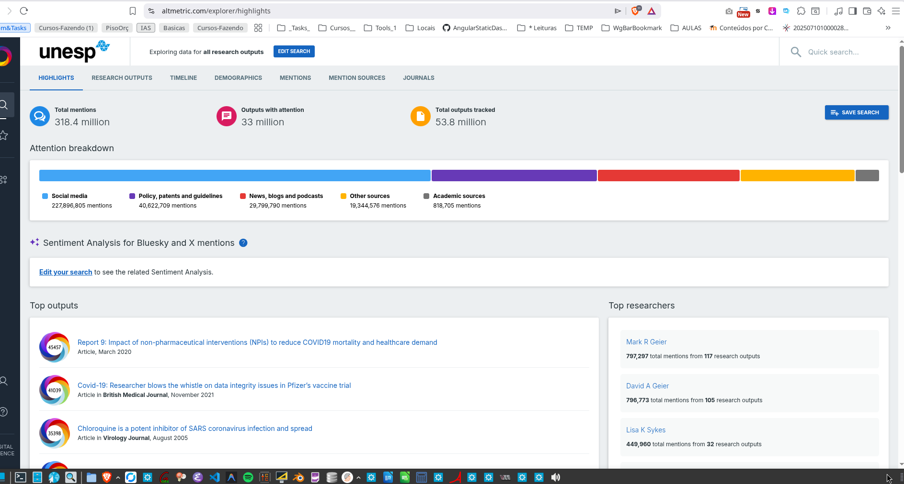
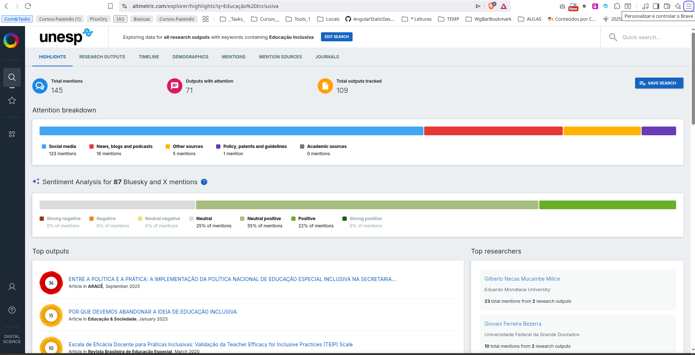
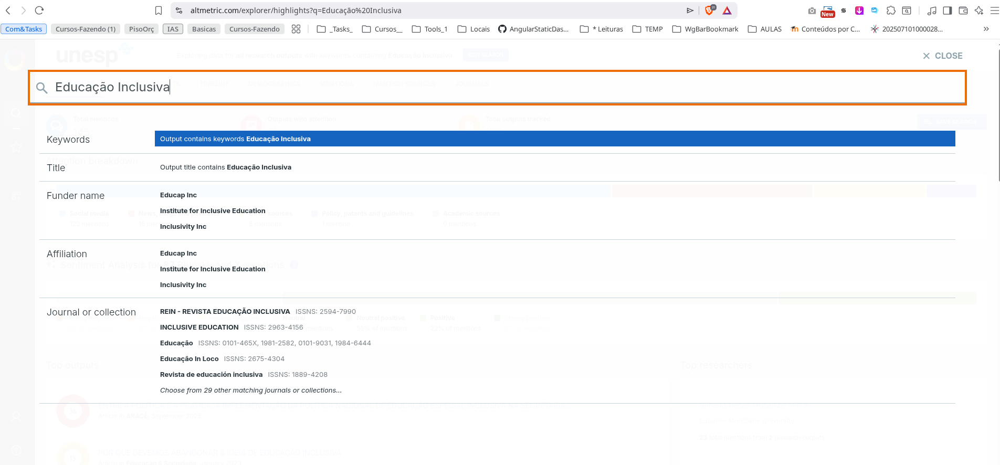
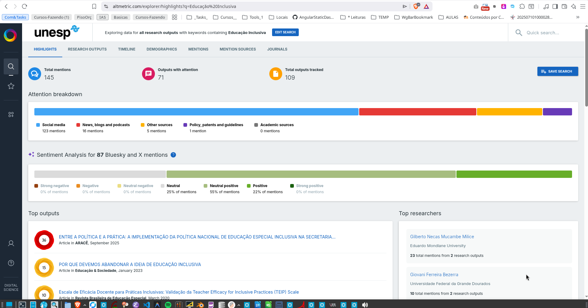

#+TITLE: Uso de IA para Pesquisa Científica
#+AUTHOR: GEPIS com ajuda do Gemini 3.5 flash e pro
#+EMAIL: contato@gepis.org
#+LANGUAGE: pt-br
#+OPTIONS: toc:t

* IA para Pesquisas Bibliograficas

Antes das IAs, as pesquisas bibliográficas retornavam resultados apenas
com base em palavras chaves. Com o uso de IA, a pesquisa, antes de
retornar os resultados, lê o conteúdo antes e provê diferente formas
de organização do retorno com base no conteúdo.

** Ferramenta Scopus da Elsevier

A [[https://www.scopus.com][scopus]] é a ferramenta de busca da Elsevier

+ Resumo

  Ative o "AI Query Builder" e escreva sua pesquisa com linguagem
  natural e a ferramenta cria a sintaxe de pesquisa com os respectivos
  "AND" e "OR" pra vc.

  Precisa do email da universidade e estar conectado com eduroam
  

+ Link de acesso:

  https://www.scopus.com/

  
+ Demonstração de pesquisa
  
  [[./imgs/scopus-demo.png][Clicar aqui para abrir a demo]]

  
+ Mais informações sobre a ferramenta
  
  [[https://service.elsevier.com/app/answers/detail/a_id/14799/supporthub/scopus/#doc][Tutoriais oficiais do scopus]]

** Ferramenta sicencedirect-LeapSpace da Elsevier

   + Resumo

     O LeapSpace é um chat de IA, mas as respostas provêm de artigos com as devidas citações

     Requer login com email da universidade e conexao com a eduroam
     
   
   + Link de Acesso

     https://www.sciencedirect.com/leapspace

     
   + Demostração
     (Tem agente? Ver c/ prof. Terlys)
     
   + Mais informações
     
     
** Ferramenta Google Escolar Labs

   + Resumo

     O Google Escolar agora tem o labs. Embora seja uma ferramenta,
     segundo a Google, experimental, está funcionando muito bem.

     Sendo assim é possível então usar linguagem natural para
     pesquisar no google escolar.
     
   + Link de Acesso

     https://scholar.google.com.br/scholar_labs/search?hl=pt-BR
     
   + Demonstração

     #+BEGIN_CARROSSEL

     #+ATTR_HTML: :width 70%     
     

     #+ATTR_HTML: :width 70%
     

     #+ATTR_HTML: :width 70%
     
     
     #+END_CARROSSEL

   + Mais informações

     https://blog.google/products-and-platforms/products/education/google-scholar-labs/

     https://www.youtube.com/watch?v=kpETz6pORck

** Ferramenta Consensus

   + Resumo

     Resultados com recursos gráficos muito interessantes

     O recurso gráfico mais famoso é a barra da métrica de consenso
     
  
   + Link de Acesso

     https://consensus.app/
     

   + Demostração

     Agente no chatgpt (Prof. Terlys)

     
     #+ATTR_HTML: :width 70%
     [[./imgs/consesus-demo.png]]

     Consulte [[https://consensus.app/search/defectologia-e-conhecimento-pedagogico/Sb6iA8yJRyKB4UvKi8qebw/?utm_source=share&utm_medium=clipboard][aqui]] e  [[https://consensus.app/search/quais-tipos-de-inclusao-escolar-sao-mais-efetivas/vPQERQjpQTqhH6LLK4UOrA/?utm_source=share&utm_medium=clipboard][aqui]] resultados obtidos da consesus

     Este resultado [[https://consensus.app/search/vitamina-k2-e-boa-para-absorcao-de-calcio/CUguSAVoRxOCSqphwKaNAA/?utm_source=share&utm_medium=clipboard][aqui]] traz o a métrica de consensu

     
   + Mais informações

     https://www.youtube.com/@ConsensusNLP  

     
** Ferramenta Elicit

   + Resumo
  
     Apesar de ser uma ferramenta paga, o trial de 7 dias pode ser
     muitíssimo útil durante a elaboração de uma pesquisa bibliográfica.
   
   + Link de Acesso

     https://elicit.com/

   + Demostração

     (Tem agente? Ver c/ prof. Terlys)
          
     Ferramenta paga, dá pra usar gratuitamente por 7 dias no trial 

     #+ATTR_HTML: :width 70%
     [[./imgs/elicit-trial-offer.png]]

     Veja um exemplo de resultado retornado para "Which theoretical
     points about inclusive education are most contested?" ou seja,
     "quais os pontos teóricos sobre educação inclusiva são mais
     contestados?"
     
     Veja [[https://elicit.com/agent/a50a8298-c5fb-4597-9c9f-5364885c562e][aqui]] o resultado de uma pesquisa
     
   + Mais informações

     [[https://support.elicit.com/en/][Consulte aqui para saber mais sobre como usar]] o Elicit
     

** Ferramenta ScienceOs

   + Resumo

     Em princípio, mais um chat cujas respostas são provenientes de
     conteúdos de artigos científicos com as devidas citações.

     Viabiliza criação de diagramas com boa qualidade

     Conseguimos acessar publicamente

     
   + Link de Acesso

     https://app.scienceos.ai/
     

   + Demostração

     (Tem agente? Ver c/ prof. Terlys)
   
     #+ATTR_HTML: :width 70%
     
     
   #+BEGIN_CARROSSEL
   
   #+ATTR_HTML: :width 70%
   [[./imgs/scienceos-exemplo.png]]

   #+ATTR_HTML: :width 70%
   [[./imgs/scienceos-exemplo-diagrama.png]]

   #+END_CARROSSEL
   
   
   + Mais informações

     https://www.scienceos.ai/articles/beginners-guide/
     

** Ferramenta SemanticScholar

   + Resumo

     
     
   + Link de Acesso

     https://www.semanticscholar.org/

     
   + Demostração

     (Tem agente? Ver c/ prof. Terlys)
     
     #+BEGIN_CARROSSEL

     #+ATTR_HTML: :width 70%
     [[./imgs/semanticscholar-criandoconta-unesp.png]]

     #+ATTR_HTML: :width 50%
     [[./imgs/semanticscholar-criandoconta-unesp2.png]]

     #+ATTR_HTML: :width 70%
     [[./imgs/semanticscholar-criandoconta-unesp3.png]]

     #+ATTR_HTML: :width 70%
     [[./imgs/semanticscholar-exemplo-resultado-pesquisa.png]]

     #+END_CARROSSEL
   
     Exemplo de resultados de pesquisa:

     #+ATTR_HTML: :width 70%
     [[./imgs/semanticscholar-resultados.png]]

     
   + Mais informações
     
     https://www.semanticscholar.org/product/tutorials

   
** Ferramenta scimagojr
   + Resumo

   + Link de Acesso

     https://www.scimagojr.com/

     
   + Demonstração
   + Mais informações

** Ferramenta dimensions
   + Resumo
   + Link de Acesso
     
     https://www.dimensions.ai/
     
   + Demonstração
   + Mais informações

** Ferramenta Inciteful 

   + Resumo

     Muito interessante pra pesquisar quem citou quem a partir de um
     artigo específico. Artigos seminais são candidatos naturais para
     uso nesta ferramenta de pesquisa.

     Por focar nas relações entre as referencias bibliográficas
     exporta para o zotero. Assim que possível pesquisaremos se
     exporta para o mendeley.
     
     
   + Link de Acesso

     https://incitefulmed.com/academic

     
   + Demostração

     (Tem agente? Ver c/ prof. Terlys)

     Estas três imagens abaixo ilustra o resultado da pesquisa sobre
     um artigo da professora Anna Augusta sem precisar ir no site da
     Iciteful. Mas vale a visita ao site. Digite o nome da professora
     ou um outro nome para visualizar os resultados.
        
     O interessante do inciteful é que não solicitou cartao e traz à
     tona todo o contexto dos artigos mais relacionados ao tema de um
     artigo específico.
        
     Para artigos muito populares, seminais, ou basilar para uma tema
     de pesquisa, utilizar esta ferramenta para visualizar o entorno
     teórico relativo ao artigo.

     #+BEGIN_CARROSSEL

     #+ATTR_HTML: :width 70%
     [[./imgs/inciteful-resultado1.png]]

     #+ATTR_HTML: :width 70%
     [[./imgs/inciteful-resultado2.png]]
     
     #+ATTR_HTML: :width 70%
     [[./imgs/inciteful-resultado3.png]]

     #+END_CARROSSEL

   + Mais informações

     https://incitefulmed.com/academic/help/quick-start

     https://incitefulmed.com/academic/help/

     
** Ferramenta doaj
   + Resumo
   + Link de Acesso
     https://doaj.org/
   + Demonstração
   + Mais informações

** Ferramenta lens

   + Resumo
   + Link de Acesso

     https://www.lens.org/

   + Demonstração
   + Mais informações

** Ferramenta clarivate

   + Resumo
   + Link de Acesso
     
     https://clarivate.com/

   + Demonstração

   + Mais informações
     

** Ferramenta altmetric

   + Resumo

     Ferramenta que traz muitas informações bibliométricas. Nos
     pareceu ser a única que preocupa-se em análise da influência ou
     impacto dos estudos científicos.

     Traz informações até sobre citações nas mídias sociais
     
   + Link de Acesso

     https://www.altmetric.com/
     
   + Demonstração

     #+ATTR_HTML: :width 70%
     

     
     #+BEGIN_CARROSSEL
     #+ATTR_HTML: :width 70%
     

     #+ATTR_HTML: :width 70%
     

     #+ATTR_HTML: :width 70%
     
     
     #+ATTR_HTML: :width 70%
     

     #+ATTR_HTML: :width 70%
     

     #+ATTR_HTML: :width 70%     
     
     
    #+END_CARROSSEL
     
   + Mais informações

     https://www.youtube.com/watch?v=01P3RAXA1PE

     https://en.wikipedia.org/wiki/Altmetric
   

** Ferramenta Open Knowledge Maps (OK Maps)

   + Resumo

     Open Knowledge Maps nos ajuda a escapar da armadilha da "lista
     infinita" dos mecanismos de busca tradicionais pois artigos por
     similaridade de texto (títulos, resumos e metadados).
     
 
   + Link de Acesso

     https://openknowledgemaps.org
     

   + Demonstração

     Veja um exemplo [[https://openknowledgemaps.org/map/b25ad6ac04732cf3c36299887be78c89][aqui]]

   + Mais informações

     https://openknowledgemaps.org/about
     
     
** Ferramenta notebooklm
   + Resumo

   + Link de Acesso

     https://notebooklm.google.com/
     
   + Demonstração

   + Mais informações
     
  
** Ferramenta opencitations

   + Resumo

     Esta ferramenta sai um pouco do eixo das pesquisas bibliográficas
     com apoio da IA por ser apenas uma base de dados abertos para
     bibliografias e bibliometrias.

     Utiliza websemanticas e dados abertos com princípios FAIR (data
     should be findable, accessible, interoperable and reusable)
     
   
   + Link de Acesso

     https://opencitations.net/
     
   + Demonstração

     
   + Mais informações

     https://www.openaire.eu/opencitations-guide
     

** Ferramenta Openalex

   + Resumo
     
     Segundo a [[https://developers.openalex.org][documentação do openalex]] o objetivo da ferramenta é ser
     grande fácil e aberto. Grande porque pode substituir bases
     comerciais como Elsevier Scopus, Clarivates. Facil de usar, para
     programadores e usuários, e prover os conjuntos de dados
     bibliográficos totalmente livre.

     De acordo com princípios de dados abertos e ciencia
     aberta. O que é livre são os metadados das pesquisas. Ferramentas de análises de dados podem obter resultados
     programaticamente para análises bibliométricas
     
     
   + Link de Acesso

     https://openalex.org
     
   
   + Demonstração

     (Tem agente? Ver c/ prof. Terlys)

     #+ATTR_HTML: :width 70%
     [[./imgs/openalex-resultados1.png]]

     
   + Mais informações

   Alguns vídeos do youtube

   https://www.youtube.com/watch?v=E56LUo-CVMk
   

** Ferramenta crossref

   + Resumo

     É basicamente um banco de dados aberto sobre referencias
     bibliográficas com contribuições de 25 mil membros, 167 países e
     2.1 bilhoes de acessos web a partir de softwares em busca de seus dados
     
   + Link de Acesso

     https://www.crossref.org/
     
   + Demonstração

     
     
   + Mais informações

     https://www.crossref.org/documentation/

     https://www.youtube.com/watch?v=exXBcDYGPaA&t=254s

     
* Resumo das Ferramentas de IA para pesquisa científica (Gerado com Gemini via Antigravity)

| Ferramenta | Uso de IA | Melhor Para / Vantagem Principal |
|------------+-----------+----------------------------------|
| Scopus | Sim, possui o "AI Query Builder" que traduz busca em linguagem natural em queries de busca complexas. | Busca de alta qualidade na tradicional base da Elsevier. |
| sciencedirect-LeapSpace | Sim, chat de IA integrado para responder a perguntas usando artigos científicos e gerando citações. | Obter respostas fundamentadas com referências diretas da Elsevier. |
| Google Escolar Labs | Sim, busca em linguagem natural e resumos experimentais de artigos baseados em IA. | Pesquisa avançada usando linguagem natural na base do Google Acadêmico. |
| Consensus | Sim, analisa e sintetiza artigos com LLMs, oferecendo o "Consensus Meter" para indicar consenso científico. | Verificação de hipóteses e síntese de evidências científicas com métrica visual. |
| Elicit | Sim, usa IA para extrair dados estruturados (amostras, dosagens, etc.), resumir artigos e criar tabelas. | Extração automatizada de dados e comparação em lote de múltiplos artigos. |
| ScienceOS | Sim, chat de IA integrado para interagir com PDFs (tabelas, figuras, texto) e gerar diagramas conceituais. | Chat interativo seguro com até 4.000 PDFs carregados e visualizações. |
| SemanticScholar | Sim, usa IA/NLP para criar resumos curtos (TL;DR), recomendar artigos e identificar citações mais influentes. | Descoberta inteligente de literatura e análise de citações de alto impacto. |
| Inciteful | Não diretamente. Baseia-se em análise de rede de citações (grafo) de quem citou quem. | Mapeamento visual de redes de citações e descoberta de artigos seminais. |
| Open Knowledge Maps | Não utiliza IA generativa. Usa algoritmos clássicos de similaridade de texto para agrupar artigos. | Visualização estruturada de tópicos e agrupamento de literatura em mapas temáticos. |
| altmetric | Não. Coleta métricas de atenção online (redes sociais, notícias, menções) via rastreadores. | Avaliar o impacto e a repercussão pública/social das publicações científicas. |
| lens | Não diretamente. Ferramenta tradicional de busca bibliográfica e de patentes integrada. | Busca robusta e unificada de patentes e artigos científicos com dados abertos. |
| scimagojr | Não. Portal de classificação de periódicos e indicadores de países com base no Scopus. | Consulta rápida de rankings (SJR) e prestígio de periódicos acadêmicos. |
| doaj | Não. Diretório online curado que indexa e fornece acesso a periódicos de acesso aberto. | Encontrar periódicos e artigos de acesso aberto revisados por pares e confiáveis. |
| dimensions | Sim, usa NLP para classificação automática de áreas do conhecimento e extração de conceitos. | Busca integrada ligando publicações, patentes, ensaios clínicos e financiamentos. |
| clarivate | Sim, integra assistentes de IA (Web of Science Research Assistant) para sintetizar buscas e gerar resumos. | Acesso estruturado à base de dados tradicional e de alto prestígio Web of Science. |
| notebooklm | Sim, alimentado pelo Gemini da Google para atuar como assistente personalizado sobre documentos enviados. | Geração de resumos, roteiros, podcasts e interações diretas com os próprios arquivos do pesquisador. |
| opencitations | Não. Infraestrutura de dados abertos para bibliografia e bibliometria com princípios FAIR. | Consulta e extração de dados bibliométricos abertos e estruturados sem barreiras comerciais. |
| Openalex | Sim, de forma algorítmica/ML para categorizar tópicos, instituições e autores. | Catálogo global aberto alternativo a bases comerciais, ideal para análises bibliométricas. |
| crossref | Não. Registro de metadados e gerador de identificadores (DOIs) mantido por editores. | Localização e resolução de metadados oficiais e referências cruzadas de publicações. |
| PapersFlow | Sim, usa multi-agentes de IA para descoberta de artigos e escrita assistida por IA. | Ciclo de vida completo da pesquisa com formatação de citações integrada. |

* Proximos Passos

Este texto é só a organização inicial das ferramentas de IA capazes
  de colaborar com a produção científica, sendo assim é uma lista não
  exaustiva e que carece ainda de mais esforços no sentido de fornecer
  informações sobre as perguntas abaixo:
  
  + Existem mais ferramentas de IA para pesquisa, como classificá-las?
  + Quais ferramentas de pesquisa pesquisam em quais bases?
  + Quais as bases mais tradicionais por área do conhecimento?
  + Em uma revisão bibliográfica sistemática, quais ferramentas de
    pesquisa bibliográfica utilizar? Devo utilizar todas?
  
Recomendações básicas:
  + Vieses das IAs

    O pesquisador deve conferir tudo que a IA lhe entrega de
    informações, caso for utilizá-las.

    Não se sabe exatamente qual possível viês uma IA pode infectar os
    resultados. Sendo assim é bom contar com seu orientador tanto para
    avaliar um possível viés como também para adequado posicionamento
    epistemógico do estudo.

    

  
