#+TITLE: Uso de IA para Pesquisa Científica
#+AUTHOR: GEPIS com ajuda do Gemini 3.5 flash e pro
#+EMAIL: contato@gepis.org
#+LANGUAGE: pt-br
#+OPTIONS: toc:t

* Introdução (Prof. Terlys)

   - Contextualização e Conceitos com base na palestra do Prof. Denis

   - Posicionamento Teórico e necessidade de orientação

     A IA retorna conteúdos sem nenhum critério, ela não tem um
     posicionamento teórico e ela erra também.

     Por esse motivo é fundamental consutar o orientador para questões
     epistemológicas durante a construção da revisão bibliográfica.
     
   - IA Não faz Rev Bibliográfica (É só uma ferramenta)

     O Planejamento da Revisão Bibliográfica deve ser feito antes do uso
     da IA e é de responsabilidade do pesquisador.

   - Declaração de Uso da IA (Links)
     

* Engenharia de Prompt (Prof. Terlys)

* IA Para Escrita Científica
** agente Academic Assistent Prof (Terlys)

* IA para Pesquisa Bibliograficas

Antigamente as pesquisas bibliográficas retornavam resultados apenas
com base em palavras chaves. Com o uso de IA, a pesquisa, antes de
retornar os resultados, lê o conteúdo antes e provê diferente formas
de organização do retorno com base no conteúdo.

** Ferramenta Scopus da Elsevier

A [[https://www.scopus.com][scopus]] é a ferramenta de busca da Elsevier

+ Resumo

  Ative o "AI Query Builder" e escreva sua pesquisa com linguagem
  natural e a ferramenta cria a sintaxe de pesquisa com os respectivos
  "AND" e "OR" pra vc.

  Precisa do email da universidade e estar conectado com eduroam
  

+ Link de acesso:

  https://www.scopus.com/

  
+ Demonstração de pesquisa
  
  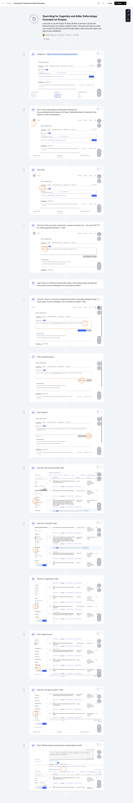

  
+ Mais informações sobre a ferramenta
  
  [[https://service.elsevier.com/app/answers/detail/a_id/14799/supporthub/scopus/#doc][Tutoriais oficiais do scopus]]

** Ferramenta sicencedirect-LeapSpace da Elsevier

   + Resumo

     O LeapSpace é um chat de IA, mas as respostas provêm de artigos com as devidas citações

     Requer login com email da universidade e conexao com a eduroam
     
   
   + Link de Acesso

     https://www.sciencedirect.com/leapspace

     
   + Demostração

     
   + Mais informações
     

** Ferramenta de pesquisa Elicit

   + Resumo
  
     Apesar de ser uma ferramenta paga, o trial de 7 dias pode ser
     muitíssimo útil durante a elaboração de uma pesquisa bibliográfica.
   
   + Link de Acesso

     https://elicit.com/

   + Demostração
  
     Ferramenta paga, dá pra usar gratuitamente por 7 dias no trial 

     #+ATTR_HTML: :width 70%
     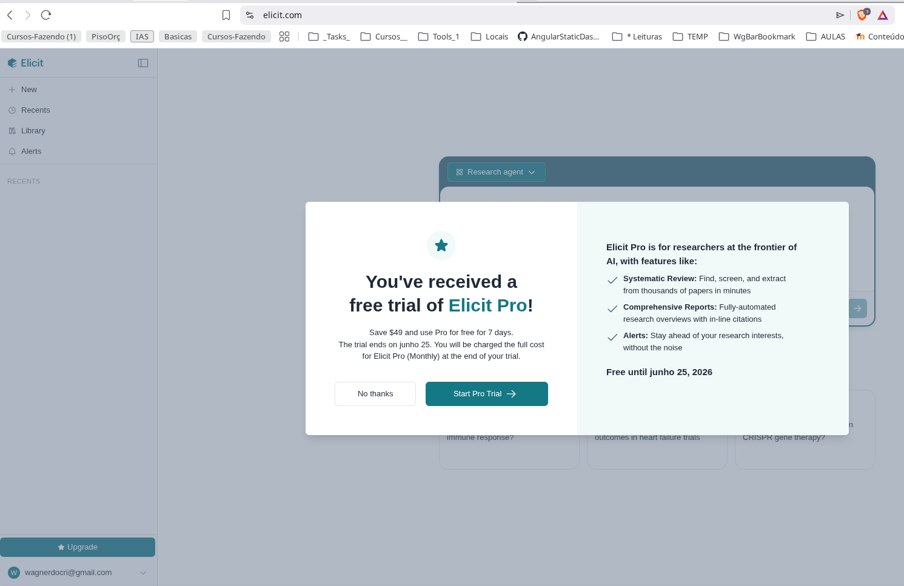

     Veja um exemplo de resultado retornado para "Which theoretical
     points about inclusive education are most contested?" ou seja,
     "quais os pontos teóricos sobre educação inclusiva são mais
     contestados?"
     
     Veja [[https://elicit.com/agent/a50a8298-c5fb-4597-9c9f-5364885c562e][aqui]] o resultado de uma pesquisa
     
   + Mais informações

     [[https://support.elicit.com/en/][Consulte aqui como usar]] o elicit
     

** Consensus (https://consensus.app)

   + Resumo

     Resultados com recursos gráficos muito interessantes

     O recurso gráfico mais famoso é a barra da métrica de consenso
     
  
   + Link de Acesso

     https://consensus.app/
     

   + Demostração

     Agente no chatgpt (Prof. Terlys)

     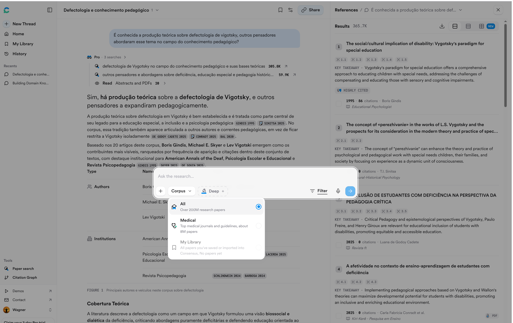

     Consulte [[https://consensus.app/search/defectologia-e-conhecimento-pedagogico/Sb6iA8yJRyKB4UvKi8qebw/?utm_source=share&utm_medium=clipboard][aqui]] e  [[https://consensus.app/search/quais-tipos-de-inclusao-escolar-sao-mais-efetivas/vPQERQjpQTqhH6LLK4UOrA/?utm_source=share&utm_medium=clipboard][aqui]] resultados obtidos da consesus

     Este resultado [[https://consensus.app/search/vitamina-k2-e-boa-para-absorcao-de-calcio/CUguSAVoRxOCSqphwKaNAA/?utm_source=share&utm_medium=clipboard][aqui]] traz o a métrica de consensu
     
   + Mais informações

     https://www.youtube.com/@ConsensusNLP  
  
** scienceos (https://www.scienceos.ai)

   + Resumo
  
   + Link de Acesso

   + Demostração

   Não conseguimoscriar um link de compartilhamento

   #+BEGIN_CARROSSEL
   
   #+ATTR_HTML: :width 70%
   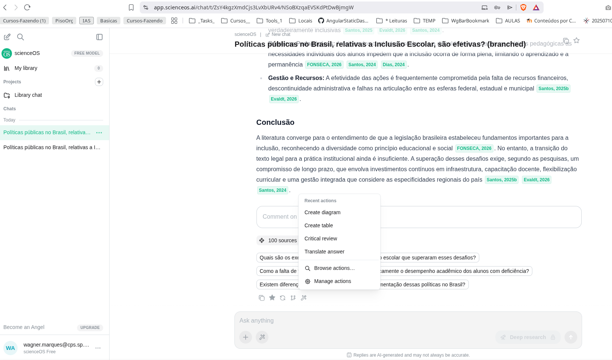

   #+ATTR_HTML: :width 70%
   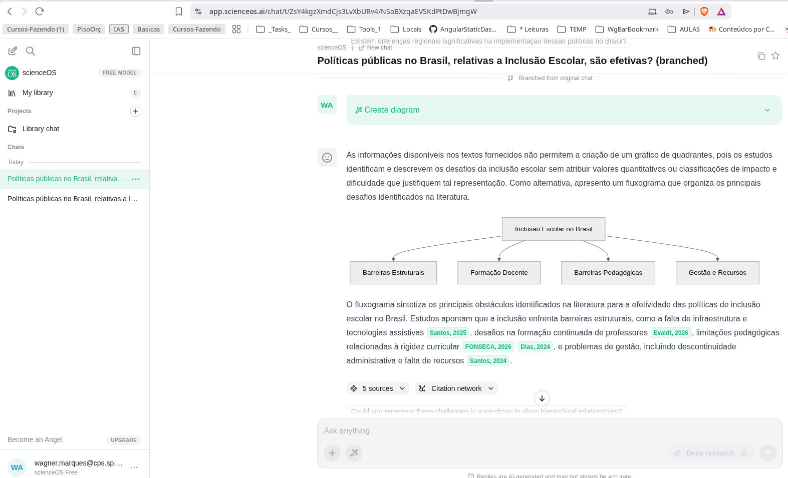

   #+END_CARROSSEL
   
   
   + Mais informações

** semanticscholar (https://www.semanticscholar.org)
#+ATTR_HTML: :width 70%
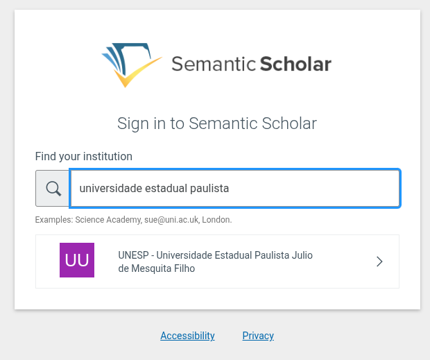

#+ATTR_HTML: :width 50%
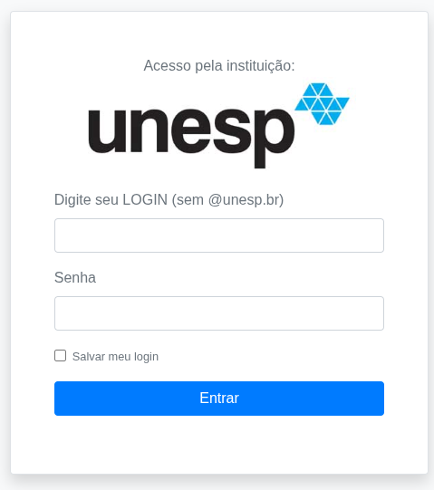

#+ATTR_HTML: :width 70%
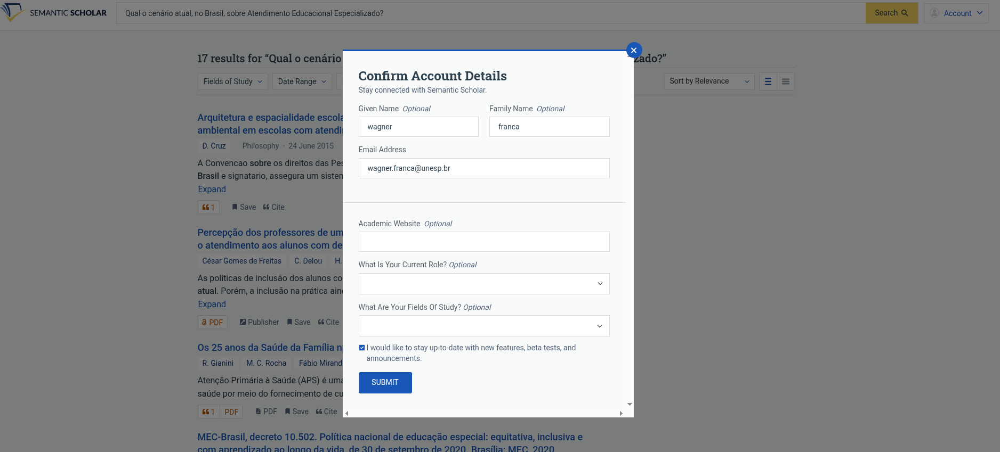

#+ATTR_HTML: :width 70%
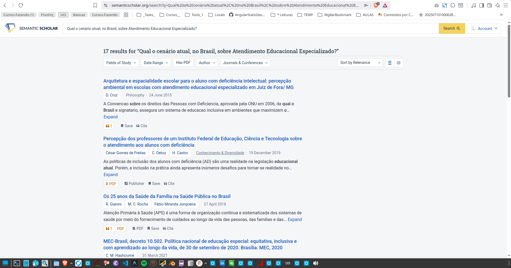

Exemplo de resultados de pesquisa:

#+ATTR_HTML: :width 70%
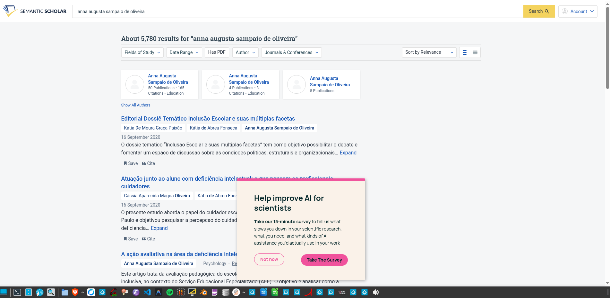

** inciteful (https://incitefulmed.com/academic)

   + Resumo
  
   + Link de Acesso

   + Demostração
  
   + Mais informações

Estas tres imagens abaixo ilustra o resultado da pesquisa sobre um
artigo da professora Anna Augusta sem precisar ir no site da
inciteful. Mas vale a visita ao site. Digite o nome da professora ou
um outro nome para visualizar os resultados.

O interessante do inciteful é que não solicitou cartao e traz à tona
todo o contexto dos artigos mais relacionados ao tema de um artigo
específico.

Para artigos muito populares, seminais, ou basilar para uma tema de
pesquisa, utilizar esta ferramenta para visualizar o entorno teórico
relativo ao artigo.

#+ATTR_HTML: :width 70%
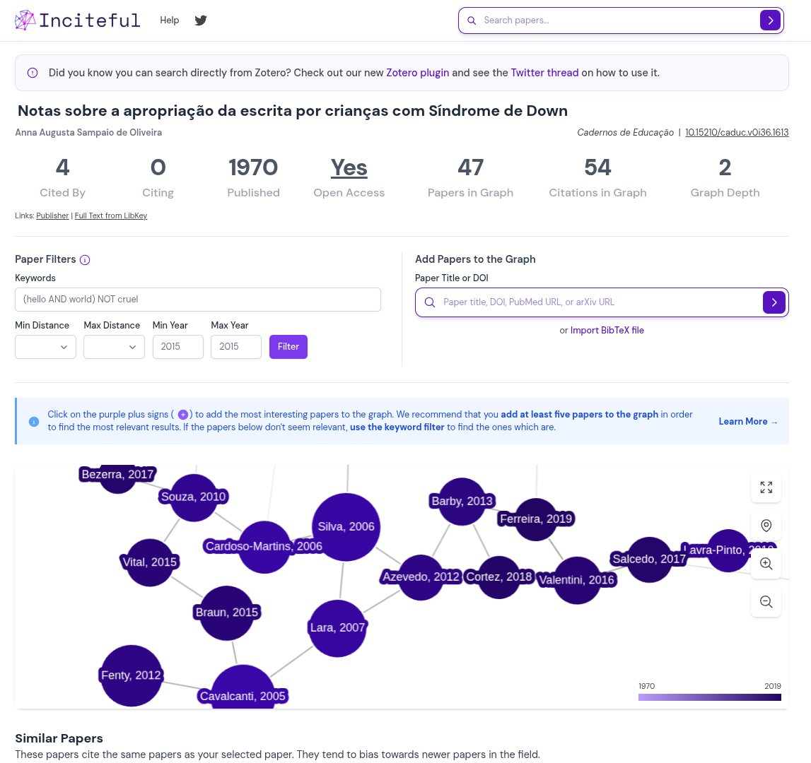

#+ATTR_HTML: :width 70%
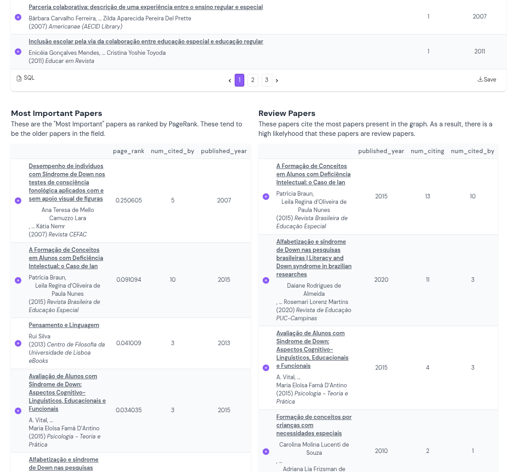

#+ATTR_HTML: :width 70%
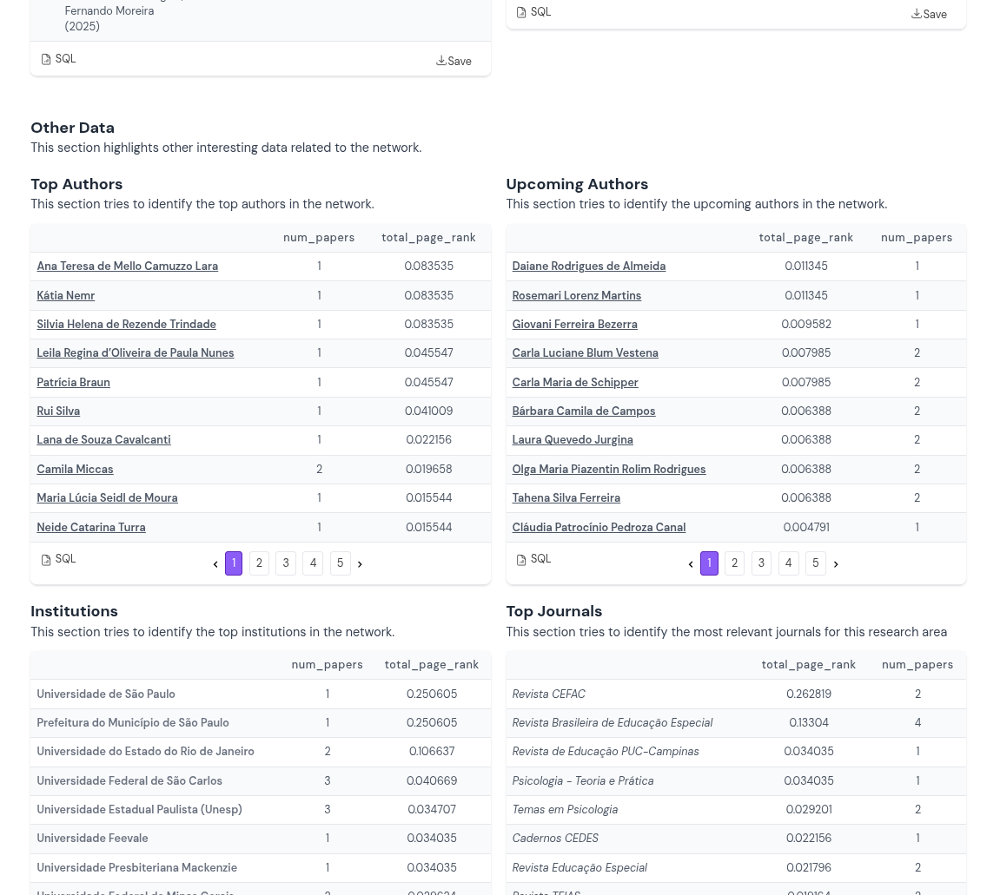

* Focadas Na Ciencia Aberta

*** [[https://openalex.org/][openalex]]
Segundo o Gemini, o objetivo é prover um catálogo totalmente aberto

#+ATTR_HTML: :width 70%
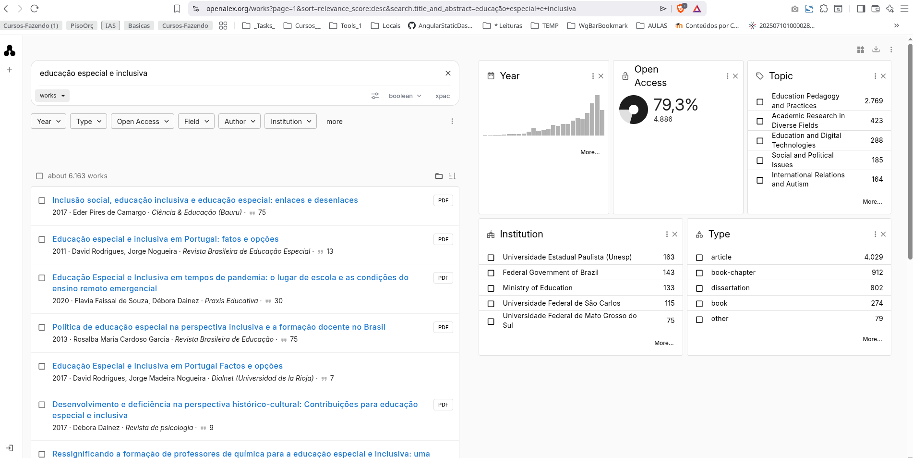

[[https://openknowledgemaps.org/][*** Open Knowledge Maps (OK Maps)]]
Open Knowledge Maps nos ajuda a escapar da armadilha da
"lista infinita" dos mecanismos de busca tradicionais pois agrupa
artigos por similaridade de texto (títulos, resumos e metadados).
Veja um exemplo [[https://openknowledgemaps.org/map/b25ad6ac04732cf3c36299887be78c89][aqui]]

*** Fluxo de Trabalho para Revisões de Literatura
- [[file:okmaps-configuracao.org][Passo 1: Definindo Fonte e Parâmetros]]
- [[file:okmaps-layout.org][Passo 2: Decodificando o Macro Layout]]

*** Estratégias de Compreensão do Mapa de Conhecimento

Uma vez gerado o mapa, existem formas estratégicas de analisá-lo para extrair o máximo de valor:

- [[file:okmaps-estrategias.org#pontes-interdisciplinares][Identificar Pontes Interdisciplinares]]
- [[file:okmaps-estrategias.org#isolar-outliers][Isolar os "Outliers"]]
- [[file:okmaps-estrategias.org#acesso-aberto][Filtrar por Representação de Acesso Aberto (Open Access)]]

*** Como funciona o Painel Interativo do Mapa de Conhecimento

Ao clicar em uma bolha, o mapa aumenta o zoom e a barra lateral direita muda dinamicamente para exibir os documentos correspondentes.

[[file:okmaps-painel.org][Veja como otimizar sua triagem dentro do painel interativo.]]

#+BEGIN_QUOTE
*Dica Pro:* Como o OK Maps renderiza seu mapa visual dinamicamente com base em um identificador exclusivo vinculado à sua string de busca, você pode copiar a URL direto da barra de endereços do seu navegador para salvá-la neste caderno Org-mode, compartilhá-la com uma equipe de pesquisa ou incorporá-la em um espaço de documentação de projeto.
#+END_QUOTE

* Resumo das Ferramentas de IA para pesquisa científica

| Ferramenta | Melhor Para                        | Vantagem Principal                                                                                                                                   |
|------------+------------------------------------+------------------------------------------------------------------------------------------------------------------------------------------------------|
| Scopus     |                                    | Elsevier é bastante tradicional                                                                                                                      |
| Elicit     | Extração de dados estruturados     | Permite carregar milhares de PDFs ou consultar sua base para criar tabelas comparativas automatizadas (ex: extraindo amostras ou doses).             |
| Consensus  | Verificação baseada em evidências  | Motor de busca em 250M+ artigos. Inclui o "Consensus Meter" que analisa se a literatura tende ao "sim", "não" ou "misto" para uma afirmação.         |
| PapersFlow | Ciclo de vida completo da pesquisa | Escolha popular para combinar descoberta de artigos via multi-agentes com escrita assistida por IA e formatação de citações integrada.               |
| scienceOS  | Chat interativo com múltiplos PDFs | Permite carregar até 4.000 PDFs em um workspace seguro para interagir com figuras, tabelas e textos, baseando-se exclusivamente nos seus documentos. |
|            |                                    |                                                                                                                                                      |

* Proximos Passos
  + Quais ferramentas de pesquisa pesquisam em quais bases?
  + Quais as bases mais tradicionais por área do conhecimento?
  
